# MongoDB Atlas Vector Search (Images) on Fashion Products

# Atlas Vector Search on Fashion Products

How can a search be conducted for the visual attributes of products that were not included in the product's metadata?
To clarify further, imagine having millions of fashion products without any information about their color or category. You have the following basic data model:

```json
{
    "imageFile": "images/7475.jpg",
    "price": 15.66,
    "discountPercentage": 7,
    "avgRating" : 3.47
}
```

Furthermore, our users wish to perform a search such as "green shirts," and our objective is to retrieve the products where the corresponding image (e.g., images/7475.jpg) portrays a green shirt. This can be easily achieved using Vector Search, as demonstrated below:

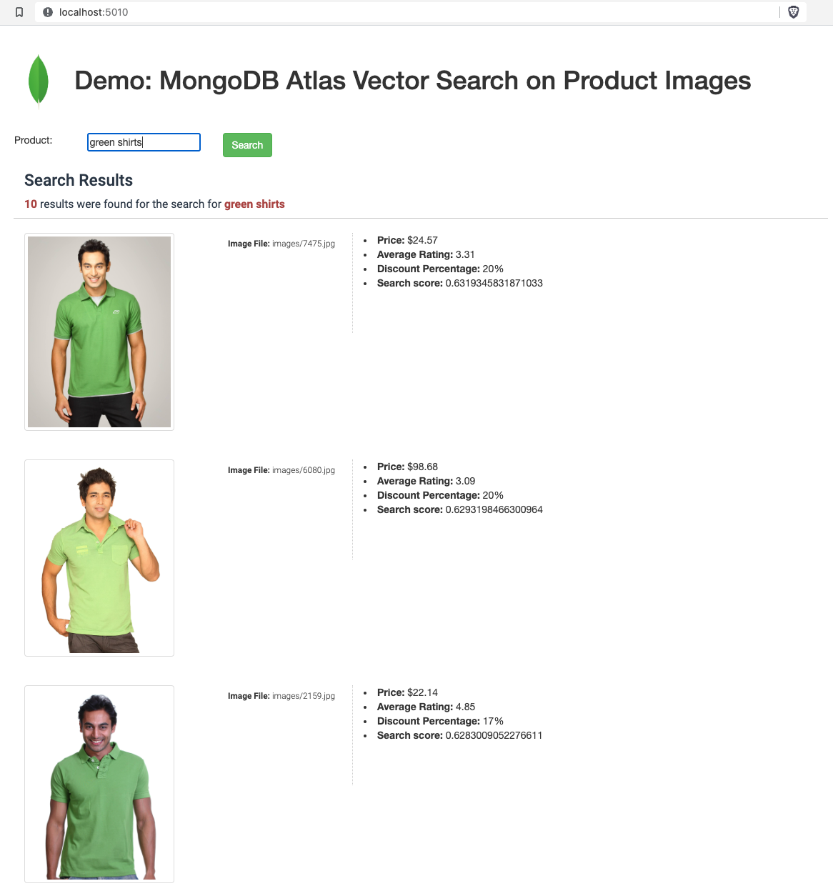
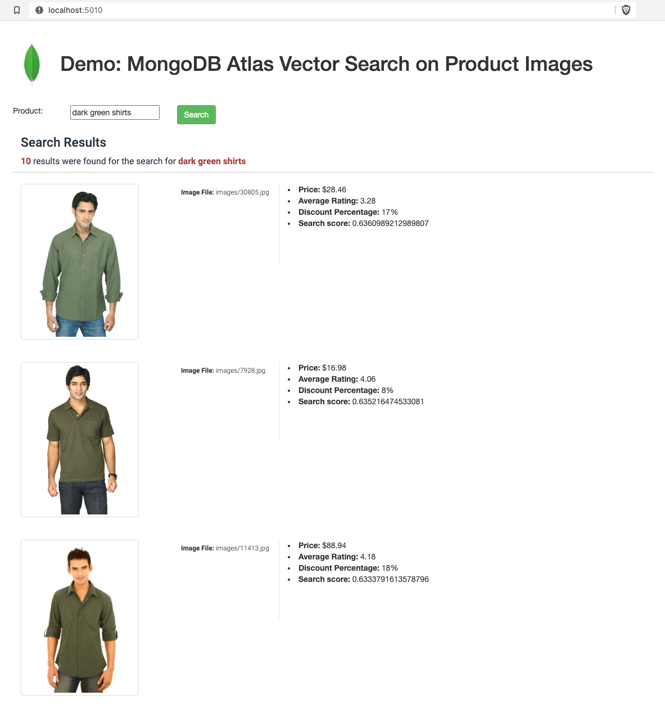

# Prerequisites

- Download the image dataset from the Kaggle. 
    - First, download the low-resolution images (280MB): https://www.kaggle.com/datasets/paramaggarwal/fashion-product-images-small
        - We'll download the high-resolution images after we confirm encoding.
        - After you've downloaded the compressed file, extract it somewhere. 
        - After the compressed file extracted, move the following `images` folder into this repository's `encoder/` folder. 
        - 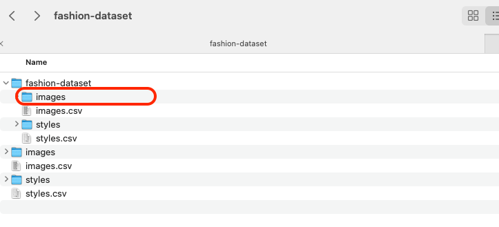
        - So the repository folders structure should look like this:
        - 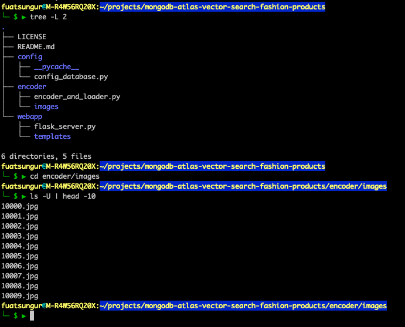
    - After you verify that everything works properly then you can download higher resolution images (25GB): https://www.kaggle.com/datasets/paramaggarwal/fashion-product-images-dataset 
- MongoDB Atlas Cluster with the M10 tier in your preferred region
- Execution was successful with the following dependencies
  - Check the steps in the section [link][# Steps to Install and Test]
  - Python 3.9.2 along with pip
    - Following libraries will be required
      - Flask==2.1.0
      - Pillow==9.3.0
      - pymongo==4.1.1
      - sentence_transformers==2.2.2
    - `requirements.txt` includes all the dependencies and if you want to install dependencies in one shot:
      ```bash
      pip install -r requirements.txt
      ```


# Steps to Install and Test

## Configure database connection 

Modify the `config/config_database.py` file accordingly with the database connection string, database and collection information. 

## Create the Search Index

Create the following search index on the collection that you configured in the config file:

```json
{
  "mappings": {
    "fields": {
      "imageVector": [
        {
          "dimensions": 768,
          "similarity": "cosine",
          "type": "knnVector"
        }
      ],
      "price": {
        "type": "number"
      },
      "averageRating": {
         "type": "number"
      },
      "discountPercentage": {
        "type": "number"
      }
    }
  }
}
```

## Run Image Encoding and Store the Vector in the database

Thousands of images have already been downloaded and we will run encoding on the application side and store the vector inside the database. 

Switch to `encoder/` folder and make sure the `images/` folder includes the image files.
And run the `encoder_and_loader.py` 

```bash
$ python encoder_and_loader.py
```

It will download the pre-trained model first and then will create worker threads and these threads will go through all the files under the `images/` folder and load the vectors inside the MongoDB collection.

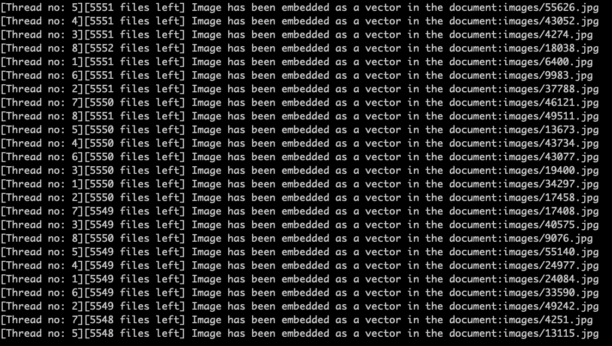

It will take some time (depending on the hardware resources on the machine where you run it. With 8 cores it might take a few hours). 
After it's completed, then verify the collection as shown in the below:

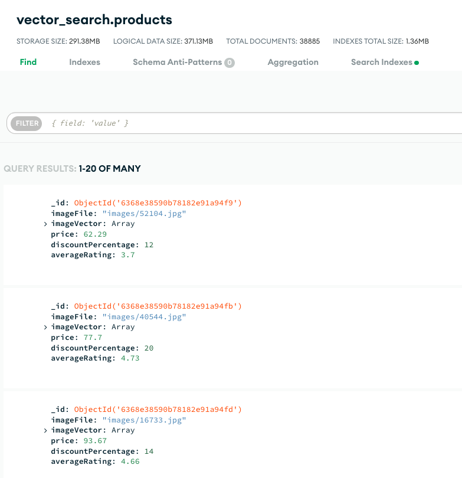

## Run the Web Application to Search for Products

Switch to `webapp/` folder and run `flask_server.py`.

```bash
$ python flask_server.py
```

This web application has 2 pages:

For a simple product search, open a browser and navigate to `http://localhost:5010/`.
For advanced search (multiple conditions), navigate to `http://localhost:5010/advanced`.

And give it a try! 
---
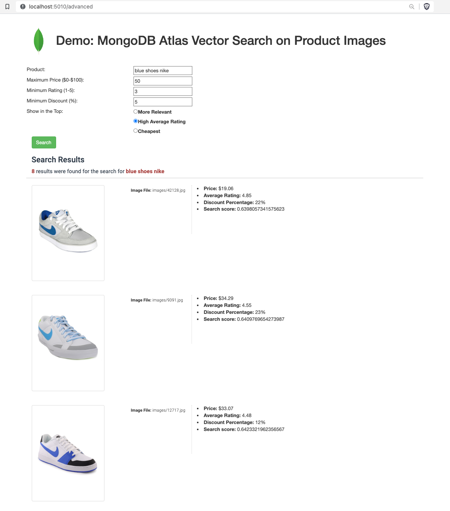
---
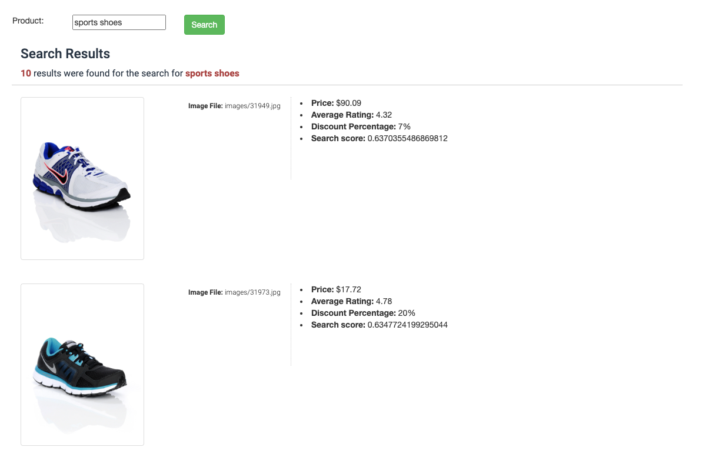
---

---
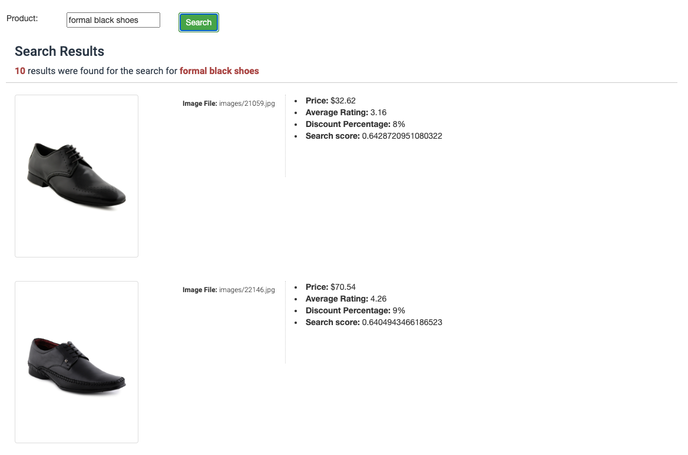
---
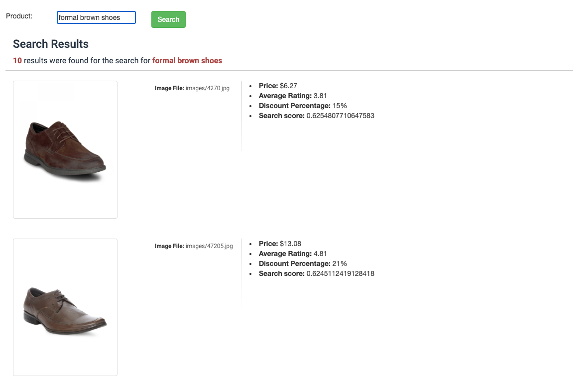
---

---
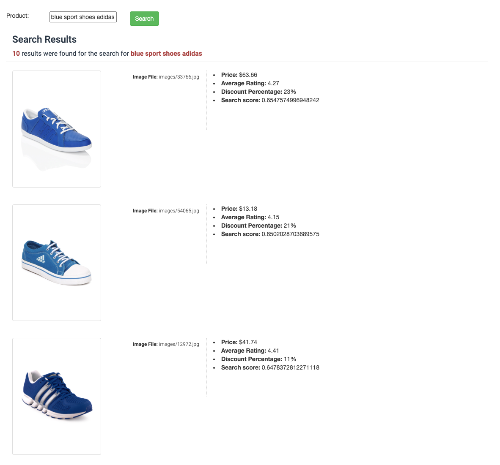
---
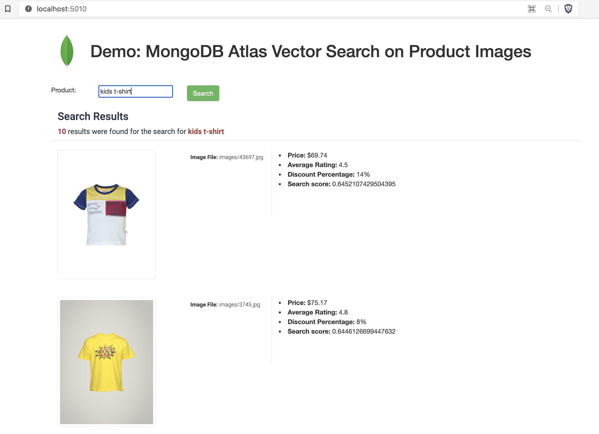
---
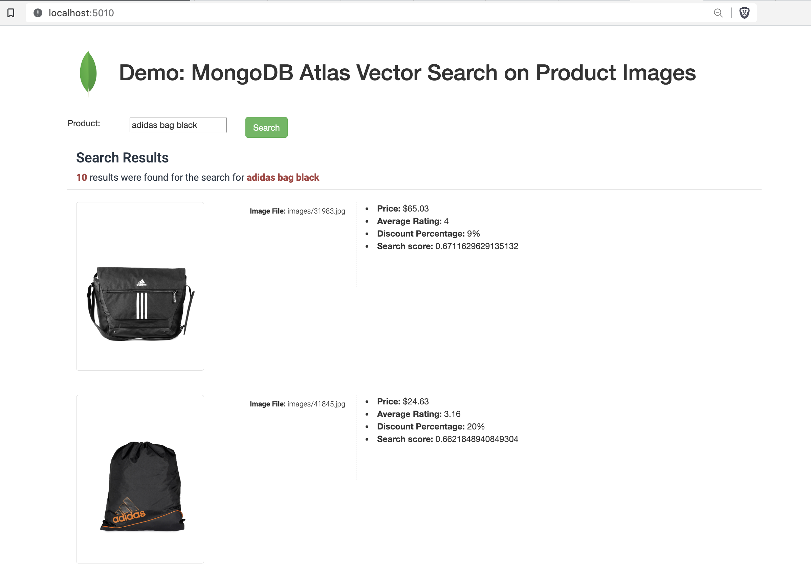
---
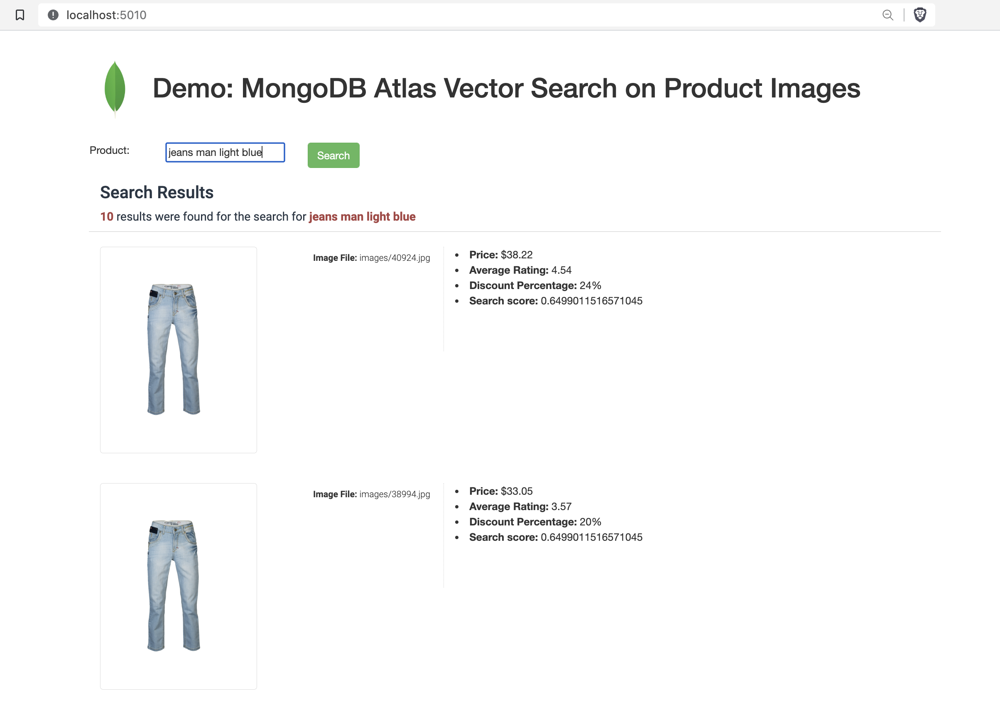
---
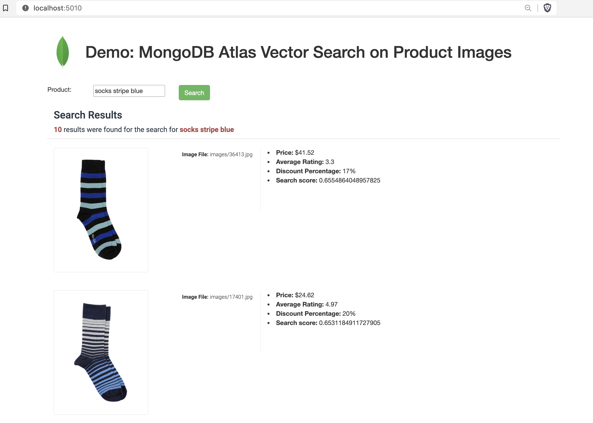


